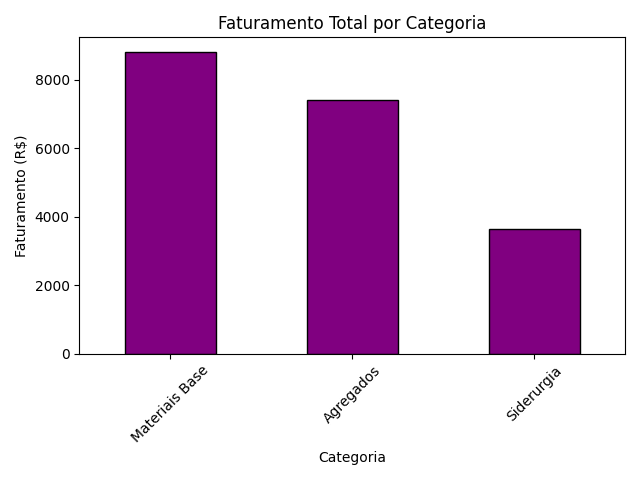

# 📊 Pandas Data Analysis Practice

This repository contains a practical project focused on **data analysis and data processing using pandas**.  
It was created as part of a hands-on learning process to simulate real-world data workflows, from raw data ingestion to analysis and visualization.

The project uses fictional sales and product datasets to demonstrate data cleaning, feature engineering, aggregation, and basic data visualization techniques commonly used in professional data analysis tasks.

---

## 🚀 Features

- Load and process raw CSV datasets
- Convert and validate data types (dates and numeric fields)
- Handle missing values and duplicate records
- Create derived columns (e.g., revenue / *faturamento*)
- Generate key performance indicators (KPIs)
- Perform aggregations and filters
- Merge multiple datasets
- Generate and save visualizations

---

## 🧠 Concepts Covered

- Data cleaning and preprocessing
- Feature engineering
- GroupBy operations and aggregations
- Filtering and sorting data
- Working with time-based data
- Dataset merging (joins)
- Basic data visualization with matplotlib
- Writing readable and structured Python scripts

---

## 🛠 Technologies Used

- **Python 3**
- **pandas**
- **matplotlib**

---

## 📑 Scripts Overview

### 01 – Basic KPIs
**File:** `01-basic-KPIs.py`

- Reads raw sales data
- Converts numeric columns
- Handles missing values
- Creates a revenue (*faturamento*) column
- Calculates total revenue by product
- Filters sales by city

---

### 02 – Data Cleaning
**File:** `02-data-cleaning.py`

- Converts date and numeric columns
- Removes duplicate records
- Removes invalid rows
- Resets index
- Outputs a technical summary of the clean dataset

---

### 03 – Sales Insights
**File:** `03-sales-insights.py`

- Builds on the cleaned dataset
- Calculates:
  - Monthly total revenue
  - Average ticket per city
  - High-volume sales analysis
- Prints analytical summaries

---

### 04 – Merge and Visualization
**File:** `04-merge-visualization.py`

- Merges sales and product datasets
- Calculates total revenue by product category
- Generates and saves a bar chart visualization

Example output:

---

## ▶️ How to Run

1. Make sure you have Python 3 installed.
2. Clone this repository:
``git clone https://github.com/PedroMagno07/pandas-data-analysis.git``
``cd pandas-practice``
3. Install the required dependencies:
pip install pandas matplotlib
4. Run any script from the src directory:
``python src/04-merge-visualization.py``

---

##📌 Notes

- This project is intended for learning and portfolio purposes
- The dataset is fictional but structured to resemble real-world scenarios
- Scripts are organized to demonstrate a clear progression of data analysis skills
